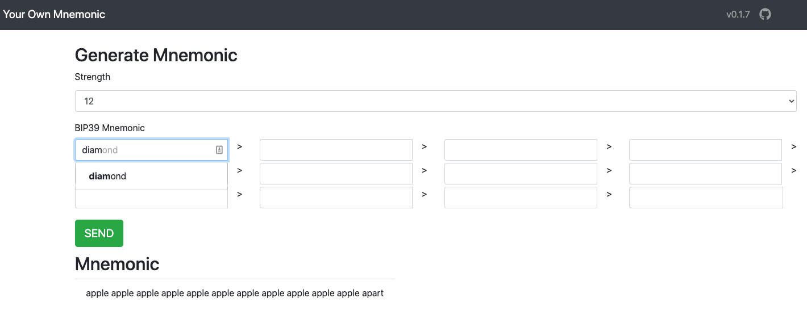

# Your Own Mnemonic

Choose your own mnemonic from 2048 words list.

## Screenshots


[[Live Preview]](https://rayspock.com/your-own-mnemonic/)

## Quick Start

```sh
# Open [http://localhost:3000](http://localhost:3000) to view it in the browser.
$ npm start 
```

## Contributing

Contribution is welcome, feel free to open an issue or pull request.